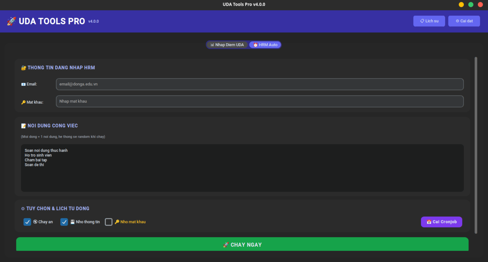

# 🚀 UDA Tools Pro v5.0

<div align="center">


**All-in-one automation tool cho giảng viên Đại học Đông Á (UDA)**

[📥 Download](#-cài-đặt) • [✨ Features](#-tính-năng) • [📖 Docs](#-hướng-dẫn-sử-dụng) • [🔧 Build](#-build)

</div>

---

## 🎯 Giới thiệu

UDA Tools Pro là bộ công cụ tự động hóa giúp giảng viên:

- **Nhập điểm hàng loạt** vào hệ thống UDA từ file Excel
- **Tự động check-in HRM** công việc hàng ngày với nội dung random
- **Lên lịch tự động** chạy hàng ngày (Cronjob)

---

## ✨ Tính năng

### 📊 Tab 1: Nhập Điểm UDA

| Tính năng            | Mô tả                                   |
| -------------------- | --------------------------------------- |
| 🔐 **Auto Login**    | Tự động đăng nhập hệ thống UDA          |
| 📥 **Import/Delete** | Nhập/Xóa điểm hàng loạt từ Excel        |
| 📋 **Multi-column**  | KTTX, CCAN, GHP, TDNH, THTN, TLDA, THI1 |
| 🌐 **Auto-detect**   | Chrome, Brave, Edge, Chromium           |
| 👁️ **Headless**      | Chạy ẩn không hiện trình duyệt          |
| 💾 **Save config**   | Nhớ tài khoản, mã môn                   |
| 📄 **Template**      | Tải file Excel mẫu                      |

### ⏰ Tab 2: HRM Auto Check-in

| Tính năng             | Mô tả                                  |
| --------------------- | -------------------------------------- |
| ✅ **Auto check-in**  | Tự động điền công việc hàng ngày       |
| 🎲 **Random content** | Mỗi ngày nội dung khác nhau            |
| 📅 **Cronjob**        | Lên lịch tự động (Windows/macOS/Linux) |
| 📆 **Select days**    | Chọn ngày chạy trong tuần              |
| 📜 **History**        | Xem lịch sử hoạt động                  |

---

## 🖥️ Screenshots

<div align="center">




_Giao diện chính của UDA Tools Pro v5.0_

</div>

---

## 📥 Cài đặt

### 🔹 Tải từ Releases (Khuyến nghị)

| Platform   | Download                        |
| ---------- | ------------------------------- |
| 🪟 Windows | `UDA_Tools_Pro-windows-x64.exe` |
| 🍎 macOS   | `UDA_Tools_Pro-macos-x64`       |
| 🐧 Linux   | `UDA_Tools_Pro-linux-x64`       |

👉 [**Download Latest Release**](https://github.com/luan-thnh/UDA_Tools/releases/latest)

### 🔹 Chạy từ Source

```bash
# Clone repo
git clone https://github.com/luan-thnh/UDA_Tools.git
cd UDA_Tools

# Cài dependencies
pip install -r requirements.txt

# Chạy
python uda_tools.py
```

---

## 📖 Hướng dẫn sử dụng

### 1️⃣ Nhập điểm UDA

1. Nhập **tài khoản/mật khẩu** UDA
2. Paste **mã môn học** từ website (VD: `Kỹ năng số (1tc)/OK//93190/7481/KL24A`)
3. Chọn file Excel hoặc **Tải mẫu** để tạo file mới
4. Chọn các cột điểm cần nhập
5. Click **NHẬP ĐIỂM**

### 2️⃣ HRM Auto Check-in

1. Nhập **email/mật khẩu** HRM
2. Nhập danh sách **nội dung công việc** (mỗi dòng 1 nội dung)
3. Click **CHẠY NGAY** hoặc **Cài Cronjob** để lên lịch

### 3️⃣ Cài Cronjob

1. Click **📅 Cài Cronjob** trong tab HRM
2. Chọn **giờ** và **ngày trong tuần**
3. Tick **Nhớ mật khẩu** (bắt buộc cho cronjob)
4. Click **Cài đặt**

---

## 📁 Cấu trúc dự án

```
📦 UDA_Tools_Pro/
├── 📄 uda_tools.py           # Main app (GUI + CLI)
├── 📄 tool_nhap_diem_uda.py  # UDA grading module
├── 📄 tool_hrm.py            # HRM module
├── 📄 build.py               # Build script
├── 📄 requirements.txt       # Dependencies
├── 📁 .github/workflows/     # CI/CD
└── 📄 README.md
```

---

## 🗂️ Vị trí lưu dữ liệu

```
~/.uda_tools/
├── config.json    # 💾 Cấu hình đã lưu
├── history.json   # 📜 Lịch sử hoạt động
└── app.log        # 📝 Log file
```

---

## 🔧 Build

### 🤖 GitHub Actions (Tự động)

```bash
git push origin main
# → Actions tự động build
# → Download từ Releases
```

### 🛠️ Build thủ công

```bash
pip install pyinstaller
python build.py
```

Output: `dist/UDA_Tools_Pro` (hoặc `.exe`)

---

## 🐛 Troubleshooting

<details>
<summary><b>❌ Lỗi "Chrome not found"</b></summary>

1. Click **⚙️ Cài đặt** góc trên phải
2. Nhập đường dẫn Chrome/Brave/Edge
3. Hoặc để trống nếu Chrome ở vị trí mặc định

</details>

<details>
<summary><b>❌ Lỗi "Timeout"</b></summary>

- Kiểm tra kết nối mạng
- Server có thể đang chậm, thử lại sau

</details>

<details>
<summary><b>❌ HRM không check-in</b></summary>

- Kiểm tra email/password
- Tắt **Chạy ẩn** để debug

</details>

<details>
<summary><b>❌ Cronjob không chạy</b></summary>

- Đảm bảo đã tick **Nhớ mật khẩu**
- Kiểm tra log: `~/.uda_tools/app.log`
- Linux: `crontab -l`
- macOS: `launchctl list | grep uda`
- Windows: Task Scheduler

</details>

---

## 📝 Changelog

### v5.0.0 (2026-01-03)

- ✨ Modern UI với gradient header
- 🎨 Card-based layout
- 📱 Responsive design với scroll
- 📅 Chọn ngày trong tuần cho cronjob
- 📥 Button tải Excel mẫu
- 🖱️ Smooth mouse wheel scrolling

### v4.0.0

- 🔗 Tích hợp HRM + UDA trong 1 app
- ⏰ Auto cronjob setup
- 📜 Lịch sử hoạt động

---

## 📄 License

MIT License © 2026

---

<div align="center">

**Made with ❤️ for UDA (Đại học Đông Á)**

[⬆ Back to top](#-uda-tools-pro-v50)

</div>
